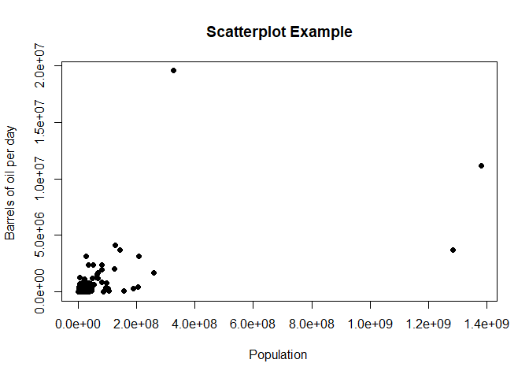

<!-- README.md is generated from README.Rmd. Please edit that file -->

# packr

<!-- badges: start -->
<!-- badges: end -->

The goal of packr is to present a minimal example of package creation in
`R`. It uses {usethis} functions to create the package, the license, and
README.Rmd file, as well as the documentation and appropriate folders
for data.

## Installation

You can install the development version of packr from
[GitHub](https://github.com) with:

``` r
if(!require(remotes)){
    install.packages("remotes")
    library(remotes)
}
remotes::install_github("paezha/packr")
```

## Example

This is a basic example which shows you how to use the package:

``` r
library(packr)
```

What is special about using `README.Rmd` instead of just `README.md`?
You can include R chunks like so:

``` r
summary(energy_and_emissions)
#>    Country               Area            Population                   PYear    
#>  Length:188         Min.   :      54   Min.   :5.292e+03   JULY 2017 EST.:188  
#>  Class :character   1st Qu.:   25618   1st Qu.:1.955e+06                       
#>  Mode  :character   Median :  113098   Median :8.101e+06                       
#>                     Mean   :  666756   Mean   :3.847e+07                       
#>                     3rd Qu.:  479278   3rd Qu.:2.558e+07                       
#>                     Max.   :16377742   Max.   :1.379e+09                       
#>      GDPPC            bblpd           EYear        CO2_1995      
#>  Min.   :   145   Min.   :     400   2014:148   Min.   :     12  
#>  1st Qu.:  1817   1st Qu.:   13000   2015: 34   1st Qu.:    936  
#>  Median :  5620   Median :   53000   2016:  6   Median :   6661  
#>  Mean   : 13572   Mean   :  490635              Mean   : 121256  
#>  3rd Qu.: 16148   3rd Qu.:  255500              3rd Qu.:  61534  
#>  Max.   :100161   Max.   :19530000              Max.   :5294648  
#>     CO2_2005          CO2_2015           Continent 
#>  Min.   :     14   Min.   :      28   Africa  :50  
#>  1st Qu.:   1379   1st Qu.:    2153   Americas:41  
#>  Median :   8434   Median :   10062   Asia    :47  
#>  Mean   : 152549   Mean   :  184978   Europe  :36  
#>  3rd Qu.:  62283   3rd Qu.:   75294   Oceania :12  
#>  Max.   :6174717   Max.   :10641789   NA's    : 2
```

You’ll still need to render `README.Rmd` regularly, to keep `README.md`
up-to-date. `devtools::build_readme()` is handy for this. You could also
use GitHub Actions to re-render `README.Rmd` every time you push. An
example workflow can be found here:
<https://github.com/r-lib/actions/tree/master/examples>.

You can also embed plots, for example:


In that case, don’t forget to commit and push the resulting figure
files, so they display on GitHub and CRAN.

And, you can include equations:


Trying github pages now.
